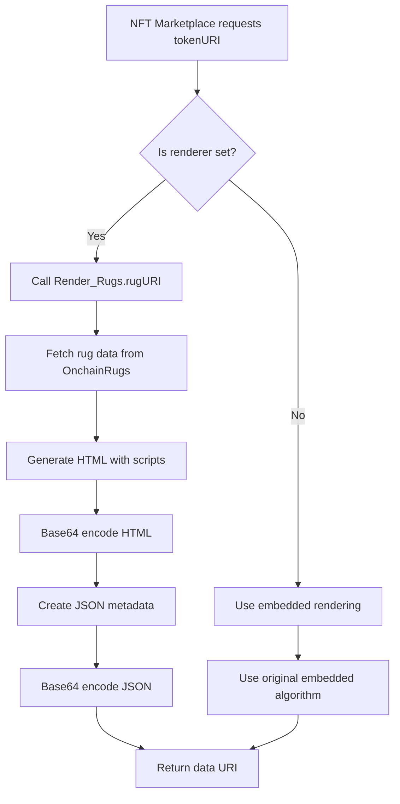

# Dynamic Rendering Architecture for OnchainRugs

## Overview

This document describes the enhanced OnchainRugs system that implements dynamic rendering capabilities inspired by the Infinite Garden architecture. The system allows for real-time updates to rendering logic, CDN fallback systems, and enhanced security features.

## Architecture Components

### 1. Core Contracts

#### `OnchainRugs.sol` (Enhanced)
- **Purpose**: Main NFT contract with rug data and minting logic
- **New Features**:
  - Integration with `Render_Rugs` contract
  - Fallback to embedded rendering if renderer fails
  - Owner-controlled renderer switching

#### `Render_Rugs.sol` (New)
- **Purpose**: Dynamic rendering engine for NFT metadata
- **Key Features**:
  - Script management system
  - CDN fallback mechanisms
  - Version tracking
  - Security monitoring

#### `IRender_Rugs.sol` (New)
- **Purpose**: Interface definition for rendering system
- **Benefits**: Clean separation of concerns and upgradeability

## Key Features

### 1. Dynamic Script Management

The renderer allows the contract owner to:

```solidity
// Add new rendering scripts
renderRugs.addToScript(true, "<script>/* new rendering logic */</script>");

// Modify existing scripts
renderRugs.modifyScript(true, 0, "<script>/* updated logic */</script>");

// Clear scripts
renderRugs.clearScript(true, 0);
```

### 2. CDN Fallback System

Multiple CDN sources ensure reliability:

```solidity
// Primary CDN
renderRugs.setCDNUrl("https://cdnjs.cloudflare.com/ajax/libs/p5.js/1.7.0/p5.min.js");

// Fallback CDN
renderRugs.setFallbackCDN("https://unpkg.com/p5@1.7.0/lib/p5.min.js");
```

### 3. Security Features

#### Access Control
- **Ownable2Step**: Two-step ownership transfer for enhanced security
- **Owner-only functions**: All configuration changes require owner privileges
- **Input validation**: Comprehensive error handling and bounds checking

#### Script Security
- **Size limits**: Scripts limited to 10KB to prevent gas issues
- **Index bounds checking**: Prevents out-of-bounds access
- **Zero address validation**: Prevents invalid contract addresses

#### Runtime Security
- **Performance monitoring**: Tracks rendering execution time
- **Environment validation**: Ensures proper execution context
- **Error handling**: Graceful degradation on failures

### 4. Rendering Flow



## Deployment Process

### 1. Deploy Main Contract
```bash
forge script script/Deploy.s.sol --rpc-url $RPC_URL --broadcast
```

### 2. Deploy Renderer
```bash
forge script script/DeployRenderer.s.sol --rpc-url $RPC_URL --broadcast
```

### 3. Setup Security
```bash
forge script script/SecuritySetup.s.sol --rpc-url $RPC_URL --broadcast
```

## Usage Examples

### Updating Rendering Logic

```solidity
// Add new visual effects
renderRugs.addToScript(true, 
    '<script>' .
    'function addGlowEffect() {' .
    '  // New glow effect implementation' .
    '}' .
    '</script>'
);
```

### Switching CDN Sources

```solidity
// Update to newer p5.js version
renderRugs.setCDNUrl("https://cdnjs.cloudflare.com/ajax/libs/p5.js/1.8.0/p5.min.js");
```

### Version Management

```solidity
// Increment version for tracking
renderRugs.setRendererVersion(2);
```

## Security Considerations

### 1. Access Control
- All configuration functions are `onlyOwner`
- Two-step ownership transfer prevents accidental transfers
- Emergency functions for critical updates

### 2. Input Validation
- Script size limits prevent gas issues
- CDN URL validation ensures proper format
- Bounds checking on all array operations

### 3. Fallback Mechanisms
- Multiple CDN sources for reliability
- Embedded rendering as ultimate fallback
- Graceful error handling and user feedback

### 4. Monitoring
- Performance tracking for rendering operations
- Version tracking for update management
- Error logging for debugging

## Benefits

### 1. Flexibility
- **Real-time updates**: Change rendering without redeployment
- **A/B testing**: Test different rendering approaches
- **Feature additions**: Add new visual effects dynamically

### 2. Reliability
- **CDN fallbacks**: Multiple sources ensure availability
- **Graceful degradation**: System continues working even with failures
- **Error recovery**: Automatic fallback mechanisms

### 3. Security
- **Access control**: Owner-only configuration changes
- **Input validation**: Comprehensive error checking
- **Monitoring**: Performance and security tracking

### 4. Maintainability
- **Modular design**: Clean separation of concerns
- **Version tracking**: Easy rollback and update management
- **Documentation**: Comprehensive code documentation

## Future Enhancements

### 1. Multi-signature Support
- Require multiple signatures for critical updates
- Time-locked changes for major modifications

### 2. Community Governance
- Allow community voting on rendering updates
- Decentralized decision making for changes

### 3. Advanced Monitoring
- Real-time performance metrics
- Automated alerting for issues
- Usage analytics and optimization

### 4. Plugin System
- Allow third-party rendering plugins
- Marketplace for rendering extensions
- Standardized plugin interface

## Conclusion

The dynamic rendering architecture provides a robust, flexible, and secure foundation for the OnchainRugs project. It enables real-time updates, ensures reliability through fallback mechanisms, and maintains security through comprehensive access controls and monitoring.

This system positions OnchainRugs as a cutting-edge NFT project that can adapt and evolve with changing requirements while maintaining the highest standards of security and reliability.
